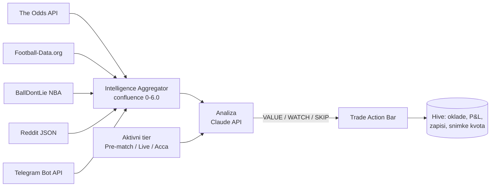

# BetSight

[English](README.md) | **Hrvatski**

> Android aplikacija za analizu sportskog klađenja koja kvote, statistiku, raspoloženje zajednice i signale tipstera spaja u jednu ocjenu po utakmici, nad njom pokreće LLM analitičara i disciplinirano bilježi svaku okladu.

    

## Sadržaj

- [Pregled](#pregled)
- [Kako radi](#kako-radi)
- [Mogućnosti](#mogućnosti)
- [Hardver i preduvjeti](#hardver-i-preduvjeti)
- [Struktura projekta](#struktura-projekta)
- [Pokretanje](#pokretanje)
- [Korištenje](#korištenje)
- [Dokumentacija](#dokumentacija)
- [Status i plan](#status-i-plan)
- [Licenca](#licenca)

## Pregled

Pronaći vrijednost u sportskom klađenju znači uočiti utakmice na kojima kladionica krivo procjenjuje vjerojatnost. Ručno to znači desetak otvorenih kartica u pregledniku: usporedbu kvota, formu momčadi, međusobne susrete, teme na Redditu, Telegram tipstere i tablicu u kojoj pratiš što si stvarno uplatio i je li se isplatilo.

BetSight sve to stavlja u jednu Android aplikaciju. Povlači kvote i statistiku iz pet neovisnih izvora, spaja ih u jedinstvenu **confluence ocjenu** po utakmici i taj strukturirani kontekst predaje Claudeu (Anthropicovom modelu) u ulozi analitičara klađenja, koji odgovara jasnom presudom **VALUE**, **WATCH** ili **SKIP**. Svaka oklada bilježi se lokalno s ulogom, kvotom i ishodom, pa se dobit i gubitak, ROI i uspješnost po sportovima s vremenom slažu u sliku tvojih vlastitih obrazaca.

BetSight **nije kladionica**: ne prima uplate, ne određuje kvote i ne uplaćuje oklade. Klađenje ostaje ručno, kod kladionice po tvom izboru. Trenutno pokriva nogomet (Premier League, Liga prvaka), košarku (NBA) i tenis (ATP singl). Verzija 3.1.3 zaokružena je u planiranom opsegu i pokrivena s 623 testa.

## Kako radi



### Tri tiera, jedna aplikacija

Odluke o klađenju razlikuju se po vremenskom horizontu, pa se cijela aplikacija prilagođava globalnom **tieru** koji se bira selektorom ispod gornje trake. Tier mijenja dodatak promptu analitičara, ponuđene prijedloge, filter oklada i prazne ekrane.

| | Pre-match | Live | Accumulator |
|---|---|---|---|
| Horizont | 24–48 h prije početka | Tijekom utakmice | Kombinacija od 2–5 parova |
| Filozofija | Temeljito istraživanje | Reakcija na zamah | Kombinacija svjesna korelacija |
| Podaci | Forma, međusobni susreti, vijesti o sastavu | Pomak kvota, promjene zamaha | Kvote po paru i provjera preklapanja |
| Glavna akcija | Zabilježi okladu | Zabilježi okladu (oznaka live) | Složi akumulator |

### Sloj informacija

Agregator za svaku praćenu utakmicu pregledava pet izvora i svakome daje ocjenu unutar fiksne težine. Zbroj je confluence ocjena, koja određuje kategoriju:

| Izvor | Težina | Što donosi |
|-------|-------:|------------|
| The Odds API | 0–2,0 | Decimalne kvote, marža kladionice, pomak iz pohranjenih snimki |
| Football-Data.org | 0–1,5 | Forma zadnjih 5, međusobni susreti, poredak (EPL, LP) |
| BallDontLie NBA | 0–1,0 | Pobjede i porazi u zadnjih 10, dani odmora |
| Reddit | 0–1,0 | Spominjanja i raspoloženje na r/soccer, r/NBA, r/sportsbook, r/tennis |
| Telegram | 0–0,5 | Signali tipstera ponderirani pouzdanošću kanala |

| Kategorija | Prag |
|------------|------|
| STRONG_VALUE | 4,5 ili više |
| POSSIBLE_VALUE | 3,0 ili više |
| WEAK_SIGNAL | 1,5 ili više |
| LIKELY_SKIP | ispod 1,5 |
| INSUFFICIENT_DATA | manje od dva aktivna izvora |

Kvote namjerno prevladavaju jer su najobjektivniji signal. Izvještaji se osvježavaju automatski i spremaju u Hive zasebno po izvoru.

### Analitičar

Ekran analize je razgovor s Claudeom preko službenog Anthropic API-ja. Svaki upit nosi sistemski prompt na engleskom, dodatak ovisan o tieru i automatski ubačen kontekst: kvote utakmice, izvještaj iz sloja informacija, relevantne signale tipstera i tvoju povijest klađenja. Odgovor završava oznakom (`**VALUE**`, `**WATCH**` ili `**SKIP**`) koju aplikacija prepoznaje; presuda VALUE otvara **Trade Action Bar** s akcijama *Log bet*, *Skip* i *Ask more*. Svaka analiza se bilježi, uz mogućnost povratne ocjene za kasniji pregled.

### Snimke i pomak kvota

Svako dohvaćanje kvota sprema se kao snimka. Usporedbom snimki dobiva se pomak po ishodu, koji ulazi u confluence ocjenu, u graf kretanja kvota i u obavijesti kad se praćena utakmica pomakne za više od 5 %. Odgovori Odds API-ja čuvaju se 15 minuta, a potrošnja besplatnih zahtjeva se prati.

### Stanje i pohrana

Stanjem upravlja Provider s osam `ChangeNotifier`a (tier, navigacija, utakmice, analiza, oklade, Telegram, informacije, akumulatori). Sve se trajno sprema lokalno u 13 Hive kutija; s mobitela odlaze samo pozivi prema navedenim servisima. API ključevi upisuju se u Postavkama i čuvaju u Hiveu, nikad u izvornom kodu.

## Mogućnosti

**Informacije i analiza**
- Confluence ocjena iz pet izvora s razradom po izvoru na Intelligence Dashboardu.
- LLM analitičar s promptom prilagođenim tieru, automatskim kontekstom i prepoznavanjem oznaka VALUE / WATCH / SKIP.
- Predlošci vrijednosti (Conservative, Standard, Aggressive) za filtriranje.
- Bot Manager za Telegram s ocjenom pouzdanosti svakog kanala (Novo, Niska, Srednja, Visoka).

**Klađenje i praćenje**
- Ručni unos oklade iz kartice Bets ili izravno iz Trade Action Bara.
- Automatsko razlikovanje live i pre-match oklade prema vremenu početka utakmice.
- Zatvaranje oklade kao Won, Lost ili Void uz automatski izračun dobiti.
- Slaganje akumulatora od praćenih utakmica s upozorenjima na povezane parove (ista utakmica, isti dan ili liga).
- Postavke bankrolla: ukupno, zadana jedinica uloga, valuta.
- Razrada po sportu: postotak pogodaka, ROI i ukupni P&L.
- Filtriranje i pretraga po sportu, statusu, rasponu datuma i tekstu.

**Grafovi**
- Kretanje kvota iz povijesti snimki.
- Forma (niz W/D/L zadnjih pet nogometnih utakmica).
- Krivulja kapitala, kumulativni P&L kroz zatvorene oklade.
- Teniski panel s favoritom, impliciranim vjerojatnostima i maržom.

**Obavijesti**
- Podsjetnici prije početka: 24 h, 1 h i 15 min.
- Upozorenja na pomak kvota veći od 5 % na praćenim utakmicama.
- Upozorenja na VALUE signal; svaka vrsta zasebno se uključuje u Postavkama.

**Ekrani**
- Četiri glavne kartice: Matches, Analysis, Bets, Settings.
- Detalji utakmice s karticama Overview, Intelligence, Charts i Notes.
- Intelligence Dashboard, Bot Manager i Accumulator Builder.

## Hardver i preduvjeti

| Stavka | Zahtjev |
|--------|---------|
| Uređaj | Android mobitel |
| Flutter / Dart | Flutter 3.41+, Dart SDK `^3.11.0` |
| Alati za build | Android SDK |

| Servis | Obavezno | Namjena |
|--------|----------|---------|
| Anthropic API ključ | Da | Analiza |
| The Odds API ključ | Da | Kvote (besplatno: 500 zahtjeva mjesečno) |
| Football-Data.org token | Preporučeno | Nogometna forma, međusobni susreti, poredak (besplatno: 10 zahtjeva u minuti) |
| Telegram bot token | Opcionalno | Praćenje kanala tipstera |
| BallDontLie | Automatski | Bez registracije |
| Reddit | Automatski | Javni JSON, oko 60 zahtjeva na sat |

### Glavne ovisnosti

| Područje | Paket |
|----------|-------|
| Stanje | `provider` 6.1 |
| Pohrana | `hive` 2.2.3 |
| HTTP | `http` 1.4 |
| Grafovi | `fl_chart` 0.69 |
| Obavijesti | `flutter_local_notifications` 18.0, `timezone` 0.10 |
| Lokalizacija | `intl` 0.20 |

## Struktura projekta

```
claude_betsight/
├── lib/
│   ├── models/      podatkovni modeli i osam ChangeNotifier providera
│   ├── services/    API klijenti, agregator informacija, Hive pohrana, obavijesti
│   ├── screens/     glavne kartice i ekrani s detaljima
│   ├── widgets/     kartice, sheetovi, selektori, grafovi
│   └── theme/       tamna tema i konstante
├── test/            unit, widget i integracijski testovi sa zajedničkim pomagalima
├── android/         Android projekt
├── assets/          release APK
├── archive/         bilješke po razvojnim sesijama i predložak dnevnika oklada
├── MANUAL.md        korisnički priručnik
├── NEWBIE_GUIDE.md  vodič za početnike, korak po korak
├── OVERVIEW.md      tehnička arhitektura
└── WORKLOG.md       dnevnik razvoja
```

Mapa `lib/` ima 64 Dart datoteke i oko 11.500 redaka; cijeli popis s opisima nalazi se u [`OVERVIEW.md`](OVERVIEW.md).

## Pokretanje

### Instalacija APK-a

1. Kopiraj `assets/betsight-v3.1.3.apk` na mobitel.
2. Dopusti upravitelju datoteka instalaciju iz nepoznatih izvora.
3. Instaliraj i otvori BetSight.

### Build iz izvornog koda

```bash
git clone https://github.com/nroxa92/claude_betsight.git
cd claude_betsight
flutter pub get
flutter analyze
flutter test
flutter build apk --debug
```

### Prvo pokretanje

Otvori **Settings** i upiši barem Anthropic i Odds API ključ. Football-Data i Telegram mogu se dodati kasnije; provideri se sami prespoje čim ključ postane dostupan, bez ponovnog pokretanja. Prije prve oklade postavi bankroll.

## Korištenje

1. **Odaberi tier** u selektoru ispod gornje trake.
2. **Matches:** pregledaj utakmice po sportu, označi zvjezdicom one koje želiš pratiti i provjeri kvote i pomak na svakoj kartici.
3. **Intelligence:** otvori utakmicu za confluence ocjenu s razradom po izvorima, grafove i svoje bilješke.
4. **Analysis:** pitaj analitičara o utakmici ili dodirni ponuđeni prijedlog. Pročitaj obrazloženje, konkretnu preporuku i završnu oznaku.
5. **Zabilježi okladu** iz Trade Action Bara ili kartice Bets. Live ili pre-match prepoznaje se automatski.
6. **Zatvori** okladu kao Won, Lost ili Void nakon utakmice i prati P&L, ROI, krivulju kapitala i rezultate po sportu.
7. **Akumulatori:** u tieru Accumulator složi kombinaciju od 2–5 parova iz praćenih utakmica i pazi na upozorenja o korelaciji.

## Dokumentacija

| Dokument | Sadržaj |
|----------|---------|
| [`NEWBIE_GUIDE.md`](NEWBIE_GUIDE.md) | Od registracije API ključeva do prve oklade, korak po korak |
| [`MANUAL.md`](MANUAL.md) | Pojmovi klađenja, tierovi, bodovanje izvora, svi ekrani, čitanje analize, zatvaranje oklada, rješavanje problema, česta pitanja |
| [`OVERVIEW.md`](OVERVIEW.md) | Arhitektura po razvojnim sesijama, graf ovisnosti, Hive kutije, popis datoteka |
| [`WORKLOG.md`](WORKLOG.md) | Dnevnik razvoja sesija 1–12.5 i poznati problemi |
| [`archive/`](archive/) | Detaljne specifikacije sesija i `BETLOG.md`, predložak za bilježenje ishoda preporuka |

## Status i plan

**Gotovo:** sesije 1–10 izgradile su aplikaciju od prvog ekrana s kvotama do okvira s tri tiera, sloja informacija iz pet izvora, grafova, obavijesti i dokumentacije. Sesije 11–12 dodale su opsežne testove: **623 testa prolaze** u 49 datoteka i pokrivaju Hive pohranu, sve providere, servise i tri cjelovita toka, uz `flutter analyze` bez ijedne primjedbe.

**Poznati problemi:**

- Jedna rupa u widget testovima: dodir na selektor tiera unutar `pumpAndSettle` zapne zbog implicitne animacije u kombinaciji s asinkronim upisom u Hive; selektor zasad pokrivaju tri osnovna testa.
- Telegram je ograničen na kanale u kojima je tvoj bot član. To je namjerno: puni korisnički API (MTProto) tražio bi pristup cijelom Telegram računu korisnika i nema produkcijski spreman Dart SDK, pa neće biti dodan. Reddit i Football-Data pokrivaju tu prazninu.

**Namjerno izvan opsega:** primanje uplata, automatsko uplaćivanje oklada i integracija s burzama oklada.

> BetSight je alat za analizu i vođenje evidencije, a ne financijski savjet. Kladi se odgovorno i nikad ne ulaži više nego što si možeš priuštiti izgubiti.

## Licenca

Objavljeno pod [MIT licencom](LICENSE) — slobodno za korištenje, izmjene i dijeljenje.
