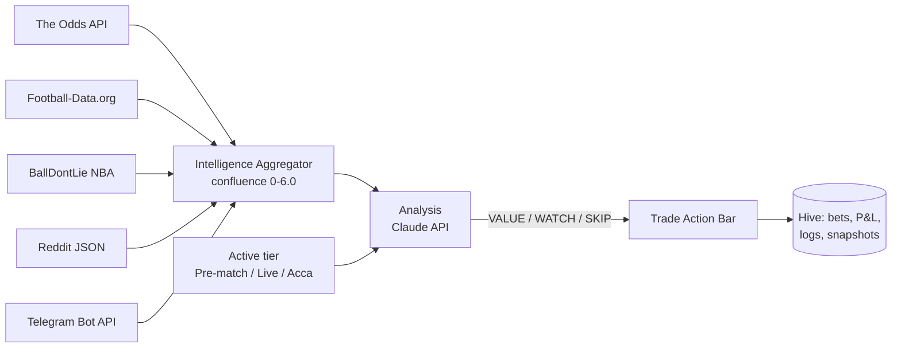

# BetSight

**English** | [Hrvatski](README.hr.md)

> A sports betting analysis app for Android that merges odds, statistics, community sentiment and tipster signals into one score per match, runs an LLM analyst on top, and keeps a disciplined record of every bet you place.

    

## Contents

- [Overview](#overview)
- [How It Works](#how-it-works)
- [Features](#features)
- [Hardware / Requirements](#hardware--requirements)
- [Project Structure](#project-structure)
- [Getting Started](#getting-started)
- [Usage](#usage)
- [Documentation](#documentation)
- [Status & Roadmap](#status--roadmap)
- [License](#license)

## Overview

Finding value in sports betting means spotting matches where the bookmaker's implied probability is wrong. Doing that by hand involves a dozen browser tabs: odds comparison, team form, head-to-head records, Reddit threads, Telegram tipsters, and a spreadsheet to track what you actually bet and whether it worked.

BetSight puts all of that in one Android app. It pulls live odds and statistics from five independent sources, combines them into a single **confluence score** per match, and hands that structured context to Claude (Anthropic's model) acting as a betting analyst that answers with a clear **VALUE**, **WATCH** or **SKIP** verdict. Every bet you place is logged locally with stake, odds and outcome, so profit and loss, ROI and per-sport performance build up over time and show you your own patterns.

BetSight is **not a bookmaker**: it takes no deposits, sets no odds and places no bets. All betting stays manual, at the bookmaker of your choice. It currently covers football (Premier League, Champions League), basketball (NBA) and tennis (ATP singles). Version 3.1.3 is feature-complete for its planned scope and backed by a 623-test suite.

## How It Works



### Three tiers, one app

Betting decisions differ by time horizon, so the whole app adapts to a global **tier** chosen with the Tier Mode Selector under the app bar. The tier changes the analyst's prompt appendix, the suggestion chips, the Bets filter and the empty states.

| | Pre-match | Live | Accumulator |
|---|---|---|---|
| Horizon | 24–48 h before kick-off | In play | Multi-match build, 2–5 legs |
| Philosophy | Deep research | React to momentum | Correlation-aware combination |
| Intelligence | Form, H2H, lineup news | Odds drift, momentum shifts | Per-leg odds and overlap checks |
| Primary action | Log bet | Log bet (live flag) | Build accumulator |

### Intelligence layer

The aggregator scans five sources for every watched match and scores each one within a fixed weight. The sum is the confluence score, which maps to a category:

| Source | Weight | What it contributes |
|--------|-------:|---------------------|
| The Odds API | 0–2.0 | Decimal odds, bookmaker margin, drift from the snapshot engine |
| Football-Data.org | 0–1.5 | Last-5 form, head-to-head, standings (EPL, CL) |
| BallDontLie NBA | 0–1.0 | Last-10 win/loss, rest days |
| Reddit | 0–1.0 | Mentions and sentiment from r/soccer, r/NBA, r/sportsbook, r/tennis |
| Telegram | 0–0.5 | Tipster signals weighted by per-channel reliability |

| Category | Threshold |
|----------|-----------|
| STRONG_VALUE | 4.5 or more |
| POSSIBLE_VALUE | 3.0 or more |
| WEAK_SIGNAL | 1.5 or more |
| LIKELY_SKIP | below 1.5 |
| INSUFFICIENT_DATA | fewer than two active sources |

Odds dominate deliberately: they are the most objective signal. Reports refresh automatically and are cached in Hive per source.

### The analyst

The analysis screen is a chat with Claude through the official Anthropic API. Each request carries an English system prompt plus a tier-specific appendix and automatically injected context: the match's odds, the intelligence report, relevant tipster signals and your own betting history. The reply ends with a marker line (`**VALUE**`, `**WATCH**` or `**SKIP**`) that the app parses; a VALUE verdict raises the **Trade Action Bar** with *Log bet*, *Skip* and *Ask more*. Every analysis is logged with optional user feedback for later review.

### Odds snapshots and drift

Each odds fetch is stored as a snapshot. Comparing snapshots yields drift per selection, which feeds the confluence score, the odds-movement chart and push alerts when a watched match moves by more than 5 %. Odds API responses are cached for 15 minutes and the free-tier request budget is tracked.

### State and storage

State management uses Provider with eight `ChangeNotifier`s (tier, navigation, matches, analysis, bets, Telegram, intelligence, accumulators). Everything persists locally in 13 Hive boxes; nothing leaves the phone except API calls to the services above. API keys are entered in Settings and stored in Hive, never in source code.

## Features

**Intelligence and analysis**
- Five-source confluence score with per-source breakdown on an Intelligence Dashboard.
- LLM analyst with tier-aware prompting, automatic context injection and parsed VALUE / WATCH / SKIP markers.
- Value presets (Conservative, Standard, Aggressive) for filtering.
- Telegram Bot Manager with per-channel reliability ratings (New, Low, Medium, High).

**Betting and tracking**
- Manual bet entry from the Bets tab or straight from the Trade Action Bar.
- Automatic live vs pre-match distinction from the match start time.
- Settlement as Won, Lost or Void with automatic P&L.
- Accumulator builder that picks legs from watched matches and warns about correlated legs (same match, same day or league).
- Bankroll settings: total, default stake unit, currency.
- Per-sport breakdown of win rate, ROI and total P&L.
- Filtering and search by sport, status, date range and text.

**Charts**
- Odds movement line chart from snapshot history.
- Form chart (W/D/L sequence of the last five football matches).
- Equity curve of cumulative P&L across settled bets.
- Tennis info panel with favourite, implied probabilities and margin.

**Notifications**
- Kick-off reminders at 24 h, 1 h and 15 min.
- Odds drift alerts above 5 % on watched matches.
- VALUE signal alerts, each type switchable in Settings.

**Screens**
- Four main tabs: Matches, Analysis, Bets, Settings.
- Match detail with Overview, Intelligence, Charts and Notes tabs.
- Intelligence Dashboard, Bot Manager and Accumulator Builder.

## Hardware / Requirements

| Item | Requirement |
|------|-------------|
| Device | Android phone |
| Flutter / Dart | Flutter 3.41+, Dart SDK `^3.11.0` |
| Build tools | Android SDK |

| Service | Required | Purpose |
|---------|----------|---------|
| Anthropic API key | Yes | Analysis |
| The Odds API key | Yes | Match odds (free tier: 500 requests per month) |
| Football-Data.org token | Recommended | Football form, H2H, standings (free tier: 10 requests per minute) |
| Telegram bot token | Optional | Tipster channel monitoring |
| BallDontLie | Automatic | No registration |
| Reddit | Automatic | Public JSON, about 60 requests per hour |

### Main dependencies

| Area | Package |
|------|---------|
| State | `provider` 6.1 |
| Storage | `hive` 2.2.3 |
| HTTP | `http` 1.4 |
| Charts | `fl_chart` 0.69 |
| Notifications | `flutter_local_notifications` 18.0, `timezone` 0.10 |
| i18n | `intl` 0.20 |

## Project Structure

```
claude_betsight/
├── lib/
│   ├── models/      data models and the eight ChangeNotifier providers
│   ├── services/    API clients, intelligence aggregator, Hive storage, notifications
│   ├── screens/     tabs and detail screens
│   ├── widgets/     cards, sheets, selectors, charts
│   └── theme/       dark theme and constants
├── test/            unit, widget and integration tests with shared helpers
├── android/         Android project
├── assets/          release APK
├── archive/         per-session development notes and the bet log template
├── MANUAL.md        user manual
├── NEWBIE_GUIDE.md  step-by-step guide for beginners
├── OVERVIEW.md      technical architecture
└── WORKLOG.md       development log
```

The `lib/` tree holds 64 Dart files and about 11,500 lines; the full annotated listing is in [`OVERVIEW.md`](OVERVIEW.md).

## Getting Started

### Install the APK

1. Copy `assets/betsight-v3.1.3.apk` to the phone.
2. Allow installation from unknown sources for your file manager.
3. Install and open BetSight.

### Build from source

```bash
git clone https://github.com/nroxa92/claude_betsight.git
cd claude_betsight
flutter pub get
flutter analyze
flutter test
flutter build apk --debug
```

### First launch

Open **Settings** and enter at least the Anthropic and Odds API keys. Football-Data and Telegram can be added later; the providers re-wire themselves when a key appears, without restarting the app. Set your bankroll before logging the first bet.

## Usage

1. **Pick a tier** in the selector under the app bar.
2. **Matches:** browse by sport, star the matches you want to watch, and check odds and drift on each card.
3. **Intelligence:** open a match to see its confluence score and per-source breakdown, charts and your notes.
4. **Analysis:** ask the analyst about a match or tap a suggestion chip. Read the narrative, the specific recommendation and the closing marker.
5. **Log the bet** from the Trade Action Bar or the Bets tab. Live or pre-match is detected automatically.
6. **Settle** bets as Won, Lost or Void once the match ends, and follow P&L, ROI, equity curve and per-sport results.
7. **Accumulators:** in the Accumulator tier, build a 2–5-leg combination from watched matches and heed the correlation warnings.

## Documentation

All documents are in Croatian.

| Document | Content |
|----------|---------|
| [`NEWBIE_GUIDE.md`](NEWBIE_GUIDE.md) | From registering API keys to the first bet, step by step |
| [`MANUAL.md`](MANUAL.md) | Betting concepts, tiers, intelligence scoring, every screen, reading the analysis, settlement, troubleshooting, FAQ |
| [`OVERVIEW.md`](OVERVIEW.md) | Architecture by development session, dependency graph, Hive boxes, file map |
| [`WORKLOG.md`](WORKLOG.md) | Development log of sessions 1–12.5 and known issues |
| [`archive/`](archive/) | Detailed session specifications and `BETLOG.md`, a template for recording outcomes of recommendations |

## Status & Roadmap

**Done:** sessions 1–10 built the app from the first odds screen to the three-tier framework, five-source intelligence, charts, notifications and documentation. Sessions 11–12 added comprehensive tests: **623 passing tests** across 49 files covering Hive storage, every provider, the services and three end-to-end flows, with `flutter analyze` at zero issues.

**Known issues:**

- One widget test gap: tapping the tier selector inside `pumpAndSettle` hangs because of an implicit animation combined with an async Hive write; three smoke tests cover the selector for now.
- Telegram is limited to channels where your bot is a member. This is by design: the full user API (MTProto) would require access to the user's entire Telegram account and has no production-ready Dart SDK, so it will not be added. Reddit and Football-Data cover the gap.

**Out of scope by design:** taking deposits, automated bet placement, and betting exchange integration.

> BetSight is an analysis and record-keeping tool, not financial advice. Bet responsibly and never stake more than you can afford to lose.

## License

Released under the [MIT License](LICENSE) — free to use, modify and share.
